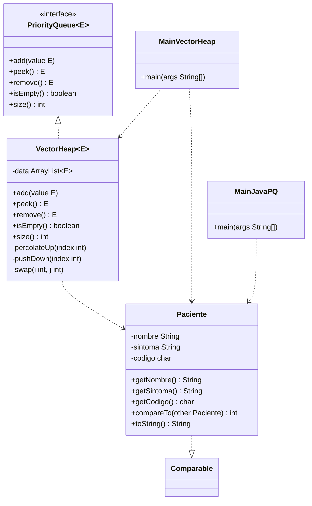

# Hoja de Trabajo 8 — Sistema de Colas con Prioridad

CC2003 Algoritmos y Estructura de Datos — Universidad del Valle de Guatemala

Patient triage system for a hospital emergency room. Patients are attended in priority order (A = highest, E = lowest) using a min-heap.

## Structure

```
src/main/java/uvg/edu/gt/
  PriorityQueue.java    # ADT interface
  VectorHeap.java       # min-heap backed by ArrayList
  Paciente.java         # patient model, implements Comparable
  MainVectorHeap.java   # program using VectorHeap
  MainJavaPQ.java       # program using java.util.PriorityQueue
src/test/java/uvg/edu/gt/
  VectorHeapTest.java   # JUnit 5 tests
pacientes.txt           # sample input
```

## UML



## Input format

`pacientes.txt` — comma-separated: `nombre, sintoma, codigo`

```
Juan Perez, fractura de pierna, C
Maria Ramirez, apendicitis, A
Lorenzo Toledo, chikunguya, E
Carmen Sarmientos, dolores de parto, B
```

## Run

```bash
mvn exec:java -Dexec.mainClass=uvg.edu.gt.MainVectorHeap
mvn exec:java -Dexec.mainClass=uvg.edu.gt.MainJavaPQ
```

## Test

```bash
mvn test
```

## Javadoc

```bash
mvn javadoc:javadoc
# output: target/site/apidocs/
```
